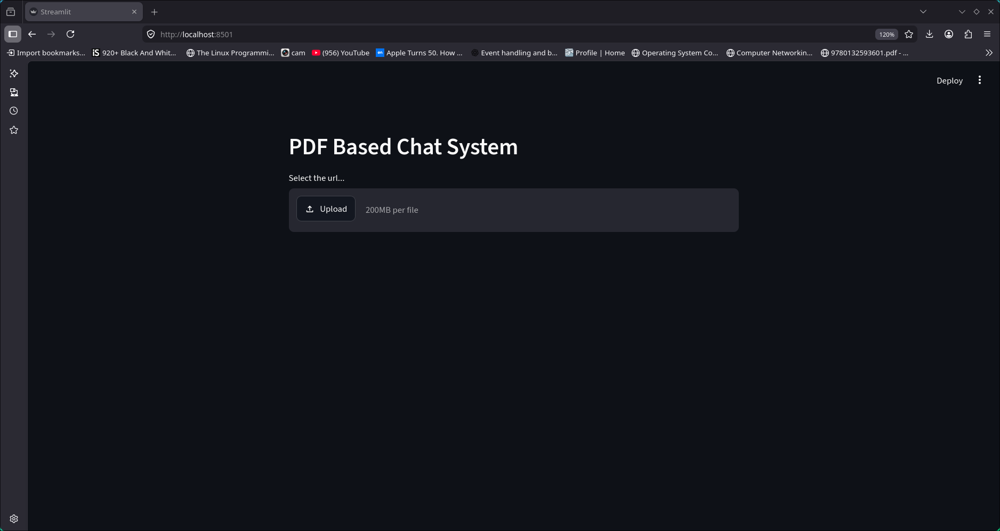
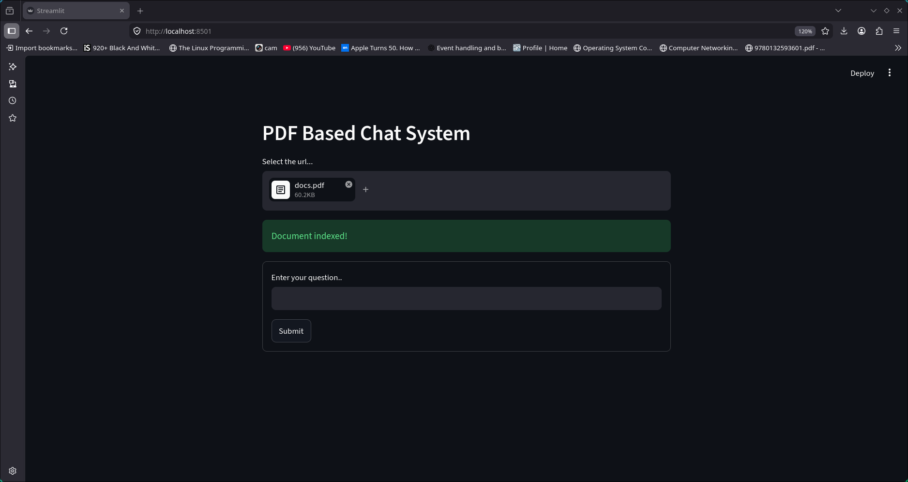
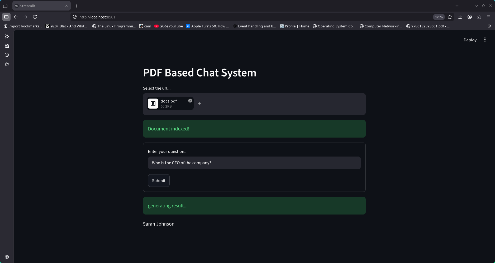
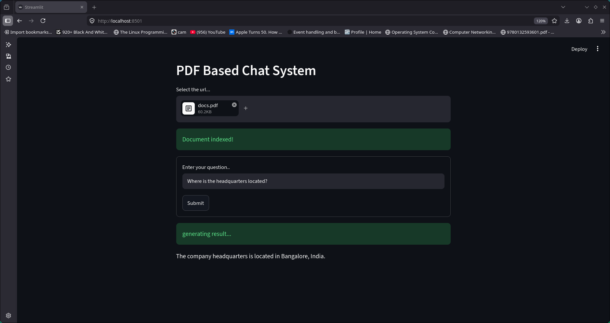
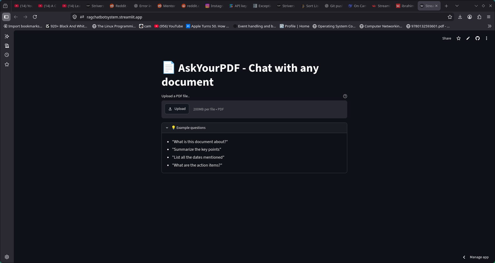

# 📄 PDF RAG Chatbot

**Chat with any PDF document using the power of AI.**

## 🚀 Live Demo

**[👉 Click here to try the live app](https://ragchatbotsystem.streamlit.app)**

---

## ✨ What It Does

Upload any PDF and have a real conversation with it. Ask questions in plain English — the AI finds answers directly from your document.

**Key Features:**
- 📑 **Upload any PDF** — books, papers, reports, manuals
- ❓ **Ask questions** in natural language
- 🤖 **Get accurate answers** grounded in the document's actual text
- 🔍 **Source-backed responses** — no hallucinations, only what's in your PDF
- ⚡ **Fast & easy** to use — no setup required for end users

---

## 📸 Screenshots

| Interface | Select Document |
|-----------|----------------|
|  |  |

| Question 1 | Question 2 |
|------------|------------|
|  |  |



---

## 🧠 How It Works (RAG Pipeline)

This project uses **Retrieval Augmented Generation (RAG)** — giving the LLM access to your private document without retraining it.

```
PDF → Split into chunks → Embed chunks → Store in Vector DB
                                                  ↓
User Question → Embed question → Find similar chunks → LLM generates answer
```

1. **Load & Split** — PDF text is extracted and split into overlapping chunks
2. **Embed** — Each chunk is converted to a vector using `all-MiniLM-L6-v2`
3. **Store** — Embeddings are stored in a FAISS vector database
4. **Retrieve** — Your question is embedded and matched against stored chunks
5. **Generate** — Relevant chunks are passed to the LLM to generate a grounded answer

---

## 🛠️ Tech Stack

| Layer | Technology |
|-------|-----------|
| **UI & Deployment** | [Streamlit](https://streamlit.io/) |
| **Language** | Python 3.9+ |
| **RAG Framework** | [LangChain](https://www.langchain.com/) |
| **Vector Database** | FAISS |
| **Embeddings** | Hugging Face `sentence-transformers` |
| **PDF Parsing** | PyPDF |
| **LLM** | OpenAI GPT / configurable |

---

## 💻 Run Locally

```bash
# 1. Clone the repo
git clone https://github.com/ibrahimfadu/PDF_RAG_chatbot.git
cd PDF_RAG_chatbot

# 2. Create and activate virtual environment
python -m venv venv
source venv/bin/activate        # Windows: venv\Scripts\activate

# 3. Install dependencies
pip install -r requirements.txt

# 4. Set up environment variables
cp .env.example .env
# Edit .env and add your API key:
# OPENAI_API_KEY=your_key_here

# 5. Run the app
streamlit run main.py
```

Open your browser at `http://localhost:8501`

---

## 📁 Project Structure

```
PDF_RAG_chatbot/
├── main.py              # Streamlit app entry point
├── run.py               # Runner script
├── requirements.txt     # Python dependencies
├── .env.example         # Environment variable template
├── doc/                 # Sample documents
└── Screenshots/         # App screenshots
```

---

## 🗺️ Roadmap

- [ ] Support for Word, PPT, and TXT files
- [ ] Switch between different LLMs (GPT-4, Llama, Mistral)
- [ ] Persistent chat history sidebar
- [ ] OCR support for scanned PDFs
- [ ] Multi-document querying

---

## 🙏 Acknowledgements

- Inspired by [LangChain RAG tutorials](https://python.langchain.com/docs/tutorials/rag/)
- UI powered by [Streamlit](https://streamlit.io/)

---

[](https://ragchatbotsystem.streamlit.app)
[](https://opensource.org/licenses/MIT)
[](https://www.python.org/)


## 📄 License

This project is licensed under the **MIT License** — see the [LICENSE](LICENSE) file for details.

---

<p align="center">Made with ❤️ by <a href="https://github.com/ibrahimfadu">ibrahimfadu</a></p>
